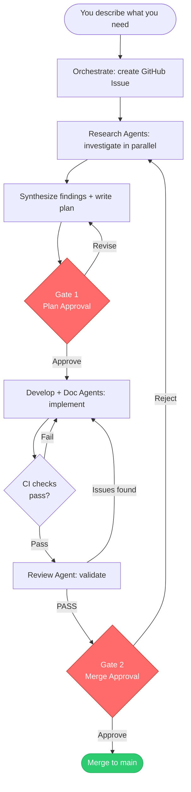

# Auto — Multi-Agent Software Development Template

A project template that structures development using specialized GitHub Copilot agents, test-driven development, and GitHub Issues.

## Quick Start

1. Clone this template into your new project
2. Configure MCP write access — **required once per repo:** [`docs/auto/copilot-cloud-setup.md`](docs/auto/copilot-cloud-setup.md)
3. Start working:
   - **From GitHub:** Open Copilot Chat → `@issue Add a contact form`
   - **From VS Code:** Open Copilot Chat → `@orchestrate`

## How It Works

You describe what you need. Agents handle research, planning, implementation, and review. You approve the plan and the merge — everything else is automated.



Every piece of work is tracked as a GitHub Issue, developed on its own `issue/{number}` branch, implemented test-first, and documented before reaching `main`. You stay in control at two gates: the plan and the merge.

## Setup

### Required: MCP Write Access

Agents need write access to create issues, branches, and pull requests. This is a one-time setting per repository.

→ Follow [**`docs/auto/copilot-cloud-setup.md`**](docs/auto/copilot-cloud-setup.md)

### GitHub-Native Mode

Drive the workflow entirely from GitHub — no local IDE required.

**Prerequisites:**
- GitHub Copilot with coding agent (assign-to-Copilot) access
- MCP write access configured (see above)

**Steps:**
1. Open Copilot Chat on GitHub → `@issue <description>`
2. Review the plan the Issue Agent posts as an issue comment and approve it
3. Assign **Copilot** to the issue — implementation starts on `issue/{number}`
4. When CI passes, the Review Agent validates automatically
5. Approve the merge — branch merges to `main` and the issue closes

### VS Code Mode

**Prerequisites:**
- [GitHub Copilot Chat](https://marketplace.visualstudio.com/items?itemName=GitHub.copilot-chat) extension installed
- Repository cloned locally
- MCP write access configured (see above)
- Git hooks activated (run once after cloning): `git config core.hooksPath .githooks`

**Steps:**
1. Open Copilot Chat → `@orchestrate`
2. Describe what you need — the agent creates a GitHub Issue, runs research, and writes a plan
3. Approve the plan (Gate 1)
4. Agents implement the work on a feature branch
5. Review the output and approve the merge (Gate 2)

## Configuration

`workflow.conf` is auto-detected from your project on first use (reads `package.json`, `pyproject.toml`, `go.mod`, `Cargo.toml`, etc.). Edit manually only if auto-detection doesn't match your setup.

## Agents

| Agent | Purpose |
|-------|---------|
| `@issue` | GitHub-native intake: research, planning, and Gate 1 prep |
| `@orchestrate` | VS Code entry point: creates issue, runs research, writes plan |
| `@develop` | Implements one component via Red-Green-Refactor |
| `@documentation` | Maintains `docs/` |
| `@review` | Pre-merge validation (read-only) |

## Project Structure

```
├── workflow.conf               # Test command, source/test directories
├── .github/
│   ├── copilot-instructions.md # Workspace instructions (auto-loaded by Copilot)
│   ├── agents/                 # Agent definitions (.agent.md files)
│   ├── workflows/              # GitHub Actions CI
│   └── ISSUE_TEMPLATE/         # Structured issue template
├── .githooks/                  # Git hook enforcement (local dev)
├── docs/                       # All project documentation
├── src/                        # Source code
└── tests/                      # Test files
```

## Docs

- [`docs/auto/agent-flow.md`](docs/auto/agent-flow.md) — Complete workflow specification, state machine, and agent reference
- [`docs/auto/copilot-cloud-setup.md`](docs/auto/copilot-cloud-setup.md) — MCP write access setup and language tooling
