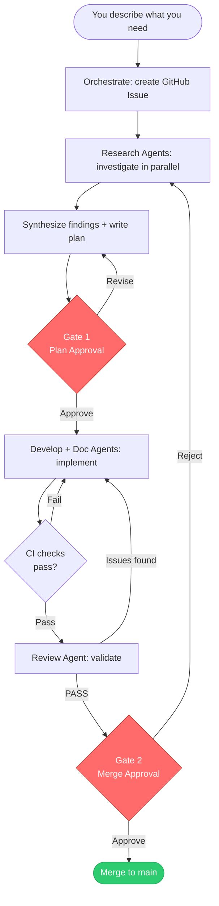

# Auto — Multi-Agent Software Development Template

A project template that structures development using specialized AI agents, test-driven development, and GitHub Issues. Works with **GitHub Copilot** and **Claude Code**.

## Quick Start

### Claude Code
1. Clone this template into your new project
2. Activate git hooks (run once): `git config core.hooksPath .githooks`
3. Open Claude Code and start working:
   - `/auto Add a contact form` — fully autonomous: research → plan → implement → review → merge
   - `/issue Add a contact form` — research, plan, and approve Gate 1 yourself (selection UI)
   - `/merge` — approve Gate 2 yourself and merge the current issue's PR (selection UI)

### GitHub Copilot
1. Clone this template into your new project
2. Configure MCP write access — **required once per repo:** [`docs/auto/copilot-cloud-setup.md`](docs/auto/copilot-cloud-setup.md)
3. Start working:
   - **From GitHub:** Open Copilot Chat → `@issue Add a contact form`
   - **From VS Code:** Open Copilot Chat → `@orchestrate`

## How It Works

You describe what you need. Agents handle research, planning, implementation, review, and merge. Run `/auto` to have the whole flow driven autonomously to `main`, or use `/issue` and `/merge` to put a human at each gate (Approve/Deny selection UI in Claude Code).


```mermaid
flowchart TD
    A([You describe what you need]) --> B[Orchestrate: create GitHub Issue]
    B --> C[Research Agents: investigate in parallel]
    C --> D[Synthesize findings + write plan]
    D --> G1{Gate 1\nPlan Approval}
    G1 -- Approve --> E[Develop + Doc Agents: implement]
    G1 -- Revise --> D
    E --> CI{CI checks\npass?}
    CI -- Fail --> E
    CI -- Pass --> F[Review Agent: validate]
    F -- Issues found --> E
    F -- PASS --> G2{Gate 2\nMerge Approval}
    G2 -- Approve --> M([Merge to main])
    G2 -- Reject --> C

    style G1 fill:#ff6b6b,color:#fff,stroke:#c0392b
    style G2 fill:#ff6b6b,color:#fff,stroke:#c0392b
    style M fill:#2ecc71,color:#fff,stroke:#27ae60
```

Every piece of work is tracked as a GitHub Issue, developed on its own `issue/{number}` branch, implemented test-first, and documented before reaching `main`. The two gates — the plan and the merge — are the control points: `/auto` self-approves them for hands-off delivery, while `/issue` and `/merge` stop for you.

## Setup

### Claude Code

**Prerequisites:**
- [Claude Code](https://claude.ai/code) installed
- Repository cloned locally

**Steps:**
1. Activate git hooks (run once after cloning): `git config core.hooksPath .githooks`
2. Open Claude Code in the repo directory
3. Use `/auto` to drive an issue autonomously to merge, or `/issue` + `/merge` to approve each gate yourself

No additional MCP configuration is needed — `gh` CLI and GitHub MCP tools work out of the box.

### GitHub Copilot — Required: MCP Write Access

Agents need write access to create issues, branches, and pull requests. This is a one-time setting per repository.

→ Follow [**`docs/auto/copilot-cloud-setup.md`**](docs/auto/copilot-cloud-setup.md)

### GitHub-Native Mode (Copilot)

Drive the workflow entirely from GitHub — no local IDE required.

**Prerequisites:**
- GitHub Copilot with coding agent (assign-to-Copilot) access
- MCP write access configured (see above)

**Steps:**
1. Open Copilot Chat on GitHub → `@issue <description>`
2. Review the plan the Issue Agent posts as an issue comment and approve it
3. Assign **Copilot** to the issue — implementation starts on `issue/{number}`
4. When CI passes, the Review Agent validates automatically
5. Approve the merge — branch merges to `main` and the issue closes

### VS Code Mode (Copilot)

**Prerequisites:**
- [GitHub Copilot Chat](https://marketplace.visualstudio.com/items?itemName=GitHub.copilot-chat) extension installed
- Repository cloned locally
- MCP write access configured (see above)
- Git hooks activated (run once after cloning): `git config core.hooksPath .githooks`

**Steps:**
1. Open Copilot Chat → `@orchestrate`
2. Describe what you need — the agent creates a GitHub Issue, runs research, and writes a plan
3. Approve the plan (Gate 1)
4. Agents implement the work on a feature branch
5. Review the output and approve the merge (Gate 2)

## Configuration

`workflow.conf` is auto-detected from your project on first use (reads `package.json`, `pyproject.toml`, `go.mod`, `Cargo.toml`, etc.). Edit manually only if auto-detection doesn't match your setup.

## Agents

### Claude Code (slash commands)

| Command | Purpose |
|---------|---------|
| `/issue` | Create issue, run parallel research, write plan, optionally split into sub-issues, present Gate 1 (selection UI) |
| `/auto` | **Auto-drive the full workflow to merge** — fully autonomous, self-approves both gates, fans out per sub-issue |
| `/merge` | Validate prerequisites, present Gate 2 (selection UI), merge, and verify success |
| `/develop` | Implement one component via Red-Green-Refactor |
| `/document` | Maintain `docs/` |
| `/review` | Pre-merge validation |
| `/research` | Single-strategy investigation (`codebase`, `docs`, `external`, `constraints`) |

### GitHub Copilot (chat agents)

| Agent | Purpose |
|-------|---------|
| `@issue` | GitHub-native intake: research, planning, and Gate 1 prep |
| `@orchestrate` | VS Code entry point: creates issue, runs research, writes plan |
| `@develop` | Implements one component via Red-Green-Refactor |
| `@documentation` | Maintains `docs/` |
| `@review` | Pre-merge validation (read-only) |
| `@merge` | Gate 2 + merge: validate prerequisites, merge, verify success |

## Project Structure

```
├── workflow.conf               # Test command, source/test directories
├── CLAUDE.md                   # Claude Code project instructions (auto-loaded)
├── .claude/
│   ├── settings.json           # Project-scoped permissions and hooks
│   └── commands/               # Slash command definitions (/issue, /auto, /develop, etc.)
├── .github/
│   ├── copilot-instructions.md # Workspace instructions (auto-loaded by Copilot)
│   ├── agents/                 # Copilot agent definitions (.agent.md files)
│   ├── workflows/              # GitHub Actions CI
│   └── ISSUE_TEMPLATE/         # Structured issue template
├── .githooks/                  # Git hook enforcement (local dev)
├── docs/                       # All project documentation
├── src/                        # Source code
└── tests/                      # Test files
```

## Docs

- [`docs/auto/agent-flow.md`](docs/auto/agent-flow.md) — Complete workflow specification, state machine, and agent reference
- [`docs/auto/copilot-cloud-setup.md`](docs/auto/copilot-cloud-setup.md) — Copilot MCP write access setup and language tooling
