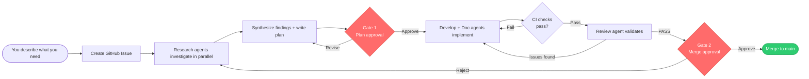

# Auto — Multi-Agent Software Development Framework

> **[→ Start here: Use the template](https://github.com/Mpfk/auto-template)** — click **"Use this template"** to create a new repo with Auto pre-configured. *This repo is the framework source — don't clone it directly.*

Auto turns a one-line request into a merged, tested, documented change. You describe what you need; a team of AI agents files a GitHub Issue, researches it, writes a plan, implements it test-first, reviews it, and merges it — pausing only at the gates you choose to control.

Runs in **Claude Code** (slash commands) and **GitHub Copilot** (chat agents). Every step is tracked in GitHub.

---

## Quick start

1. **[Use this template](https://github.com/Mpfk/auto-template)** → **"Create a new repository"**
2. Edit **`workflow.conf`** — set `TEST_CMD` for your language (e.g. `npm test`, `pytest`, `go test ./...`)
3. Run **`bin/setup-hooks`** to activate git hooks *(once per clone and once per worktree)*
4. *(Copilot only)* Grant MCP write access — required one-time step per repo: [`docs/auto/copilot-cloud-setup.md`](docs/auto/copilot-cloud-setup.md)

Then open your first issue: `/auto Add a contact form`

---

## How it works

Every change flows through the same pipeline — tracked as a GitHub Issue, developed on its own branch, implemented test-first, and documented before it reaches `main`.


```mermaid
flowchart LR
    A([You describe what you need]) --> B[Create GitHub Issue]
    B --> C[Research agents investigate in parallel]
    C --> D[Synthesize findings + write plan]
    D --> G1{Gate 1<br/>Plan approval}
    G1 -- Approve --> E[Develop + Doc agents implement]
    G1 -- Revise --> D
    E --> CI{CI checks<br/>pass?}
    CI -- Fail --> E
    CI -- Pass --> F[Review agent validates]
    F -- Issues found --> E
    F -- PASS --> G2{Gate 2<br/>Merge approval}
    G2 -- Approve --> M([Merge to main])
    G2 -- Reject --> C

    style G1 fill:#ff6b6b,color:#fff,stroke:#c0392b
    style G2 fill:#ff6b6b,color:#fff,stroke:#c0392b
    style M fill:#2ecc71,color:#fff,stroke:#27ae60
```

### The two gates

| You want… | Use | Behavior |
|-----------|-----|----------|
| Hands-off delivery | `/auto` | Self-approves both gates, drives straight to `main` — never pauses |
| Control at each step | `/issue` then `/merge` | Stops at each gate for your Approve/Deny |

```
draft → researching → planning → [Gate 1] → ready → in-progress → [CI] → review → [Gate 2] → done
```

---

## Commands

### Claude Code — slash commands

| Command | Purpose |
|---------|---------|
| `/auto` | **Drive the full workflow to merge** — fully autonomous, self-approves both gates |
| `/issue` | Create issue, run parallel research, write plan, present Gate 1 |
| `/merge` | Validate prerequisites, present Gate 2, merge, and verify |
| `/develop` | One Red-Green-Refactor cycle |
| `/review` | Pre-merge validation (TDD compliance, quality, tests, docs) |
| `/document` | Update `docs/` for completed work |
| `/research` | Single-strategy investigation (`codebase`, `docs`, `external`, `constraints`) |

### GitHub Copilot — chat agents

| Agent | Purpose |
|-------|---------|
| `@issue` | GitHub-native intake: research, planning, and Gate 1 |
| `@orchestrate` | VS Code entry point: issue + research + plan |
| `@develop` | Implements one component via TDD |
| `@review` | Pre-merge validation (read-only) |
| `@documentation` | Maintains `docs/` |
| `@merge` | Gate 2 + merge: validate, merge, verify |

---

## Core principles

Enforced by git hooks and CI — not just conventions:

- **Issue-first.** No code without a tracked GitHub Issue.
- **Branch per issue.** All work on `issue/{number}`; never directly on `main`.
- **Test-first (TDD).** Red → Green → Refactor. Tests written before implementation.
- **Conventional Commits.** `type(scope): description`.
- **Docs in `docs/`.** Keeps source trees clean.

---

## Configuration

**`workflow.conf`** is the only file you must edit — set `TEST_CMD` for your language. `SRC_DIRS`, `TEST_DIRS`, and `MAIN_BRANCH` are auto-detected from `package.json`, `pyproject.toml`, `go.mod`, `Cargo.toml`, etc.

---

## Distribution & updates

| Repo | Role |
|------|------|
| **[Mpfk/auto](https://github.com/Mpfk/auto)** | Framework source — developed and versioned here |
| **[Mpfk/auto-template](https://github.com/Mpfk/auto-template)** | The template consumers instantiate |

- **CI logic** updates automatically. Your `pr-checks.yml` references the reusable workflow by `@v1` tag. When Auto ships a release the tag moves and your repo picks up the updated CI on its next PR — no tokens, no action needed.
- **Instruction files** (slash commands, agents, hooks, `CLAUDE.md`, docs) are a one-time snapshot you own. Update by re-copying files from the template. See [`docs/auto/UPGRADING.md`](docs/auto/UPGRADING.md).

---

## Developing the framework

This section is for working on Auto's source — not for using Auto in a project.

1. Clone this repo
2. `bin/setup-hooks`
3. *(Copilot only)* Configure MCP write access: [`docs/auto/copilot-cloud-setup.md`](docs/auto/copilot-cloud-setup.md)
4. Use `/auto`, or `/issue` + `/merge`, to develop

Releases are signed semver tags. Moving `v1` to a new release rolls CI updates to every consumer repo automatically. See [`docs/auto/release-process.md`](docs/auto/release-process.md).

---

## Project structure

```
├── workflow.conf               # Test command, source/test directories, main branch
├── CLAUDE.md                   # Claude Code project instructions (auto-loaded)
├── .claude/
│   ├── settings.json           # Project-scoped permissions and hooks
│   └── commands/               # Slash command definitions (/issue, /auto, /develop, …)
├── .github/
│   ├── copilot-instructions.md # Workspace instructions (auto-loaded by Copilot)
│   ├── agents/                 # Copilot agent definitions (.agent.md files)
│   ├── workflows/              # GitHub Actions CI (reusable-pr-checks.yml + thin callers)
│   └── ISSUE_TEMPLATE/         # Structured issue template
├── .githooks/                  # Git hook enforcement (local dev)
├── bin/setup-hooks             # Idempotent git-hook activation (worktree-safe)
├── docs/                       # All project documentation
├── src/                        # Source code
└── tests/                      # Test files
```

---

## Docs

- [`docs/auto/agent-flow.md`](docs/auto/agent-flow.md) — Complete workflow spec, state machine, and agent reference
- [`docs/auto/auto-template-repo.md`](docs/auto/auto-template-repo.md) — Two-repo topology and distribution model
- [`docs/auto/file-buckets.md`](docs/auto/file-buckets.md) — Snapshot vs reusable-workflow vs config files
- [`docs/auto/copilot-cloud-setup.md`](docs/auto/copilot-cloud-setup.md) — Copilot MCP write access setup (required for Copilot users)
- [`docs/auto/release-process.md`](docs/auto/release-process.md) — Cutting framework releases
