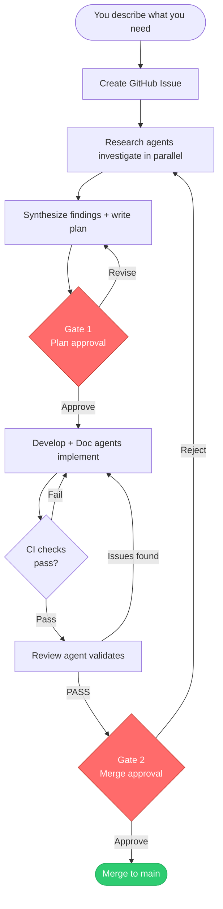

# Auto — Multi-Agent Software Development Framework

Auto turns a one-line request into a merged, tested, documented change. You
describe what you need; a team of AI agents files a GitHub Issue, researches it,
writes a plan, implements it test-first, reviews it, and merges it — pausing only
at the checkpoints you choose to control.

It runs in **Claude Code** (slash commands) and **GitHub Copilot** (chat agents),
and every step is tracked in GitHub so the work is auditable from issue to merge.

> **Using Auto in your own project?** Don't clone this repo — start from the
> template: **[Mpfk/auto-template](https://github.com/Mpfk/auto-template)** →
> click **"Use this template"**. This repo is where the framework itself is
> developed. See [Distribution & updates](#distribution--updates) for why.

---

## How it works

Every change flows through the same pipeline. Work is tracked as a GitHub Issue,
developed on its own `issue/{number}` branch, implemented test-first, and
documented before it reaches `main`.


```mermaid
flowchart TD
    A([You describe what you need]) --> B[Create GitHub Issue]
    B --> C[Research agents investigate in parallel]
    C --> D[Synthesize findings + write plan]
    D --> G1{Gate 1<br/>Plan approval}
    G1 -- Approve --> E[Develop + Doc agents implement]
    G1 -- Revise --> D
    E --> CI{CI checks<br/>pass?}
    CI -- Fail --> E
    CI -- Pass --> F[Review agent validates]
    F -- Issues found --> E
    F -- PASS --> G2{Gate 2<br/>Merge approval}
    G2 -- Approve --> M([Merge to main])
    G2 -- Reject --> C

    style G1 fill:#ff6b6b,color:#fff,stroke:#c0392b
    style G2 fill:#ff6b6b,color:#fff,stroke:#c0392b
    style M fill:#2ecc71,color:#fff,stroke:#27ae60
```

### The two gates

The pipeline has exactly two control points:

- **Gate 1 — Plan approval.** Before any code is written, you (or `/auto`) confirm
  the research and plan are sound.
- **Gate 2 — Merge approval.** Before merging, you (or `/auto`) confirm CI is
  green, the review passed, and the PR is mergeable.

**You decide who approves them:**

| You want… | Use | Behavior |
|-----------|-----|----------|
| Hands-off delivery | `/auto` | Self-approves both gates and drives straight to `main` — never pauses |
| Control at each step | `/issue` then `/merge` | Stops at each gate for your Approve/Deny |

The gates' *preconditions* always hold either way — autonomy removes the human
pause, never the safety checks.

### Status flow

```
draft → researching → planning → [Gate 1] → ready → in-progress → [CI] → review → [Gate 2] → done
```

Everything between the gates is automated.

---

## Core principles

These are enforced by git hooks and CI — not just conventions:

- **Issue-first.** No code without a tracked GitHub Issue.
- **Branch per issue.** All work on `issue/{number}` branches; never directly on `main`.
- **Test-first (TDD).** Red → Green → Refactor. Tests are written before implementation.
- **Conventional Commits.** `type(scope): description`.
- **Docs live in `docs/`.** Keeps source trees clean.

---

## Using Auto in your project

1. Go to **[Mpfk/auto-template](https://github.com/Mpfk/auto-template)** → **"Use this template"** → **"Create a new repository"**.
2. In your new repo, activate the git hooks (once):
   ```
   git config core.hooksPath .githooks
   ```
3. Enable **Settings → Actions → General → "Allow GitHub Actions to create and approve pull requests"** (lets the sync workflow open update PRs).
4. *(Optional)* Run the **Auto Framework Sync** workflow once to pull the latest framework files immediately.
5. *(Copilot only)* Grant MCP write access — one-time per repo: [`docs/auto/copilot-cloud-setup.md`](docs/auto/copilot-cloud-setup.md).

Then start working — see the two interfaces below.

---

## The two interfaces

### Claude Code — slash commands

| Command | Purpose |
|---------|---------|
| `/auto` | **Drive the full workflow to merge** — fully autonomous, self-approves both gates, fans out per sub-issue |
| `/issue` | Create issue, run parallel research, write plan, optionally split into sub-issues, present Gate 1 |
| `/merge` | Validate prerequisites, present Gate 2, merge, and verify success |
| `/develop` | Implement one component via Red-Green-Refactor |
| `/review` | Pre-merge validation (TDD compliance, quality, tests, docs) |
| `/document` | Update `docs/` for completed work |
| `/research` | Single-strategy investigation (`codebase`, `docs`, `external`, `constraints`) |

**Quickest start:** `/auto Add a contact form` — research → plan → implement → review → merge, hands-off.

### GitHub Copilot — chat agents

| Agent | Purpose |
|-------|---------|
| `@issue` | GitHub-native intake: research, planning, and Gate 1 prep |
| `@orchestrate` | VS Code entry point: creates issue, runs research, writes plan |
| `@develop` | Implements one component via Red-Green-Refactor |
| `@review` | Pre-merge validation (read-only) |
| `@documentation` | Maintains `docs/` |
| `@merge` | Gate 2 + merge: validate prerequisites, merge, verify success |

**From GitHub:** Copilot Chat → `@issue <description>` → review the posted plan →
assign **Copilot** to the issue → approve the merge when CI passes.

**From VS Code:** Copilot Chat → `@orchestrate` → describe the work → approve Gate 1
→ agents implement → approve Gate 2.

---

## Configuration

`workflow.conf` (test command, source/test directories, main branch) is
auto-detected from your project on first use — it reads `package.json`,
`pyproject.toml`, `go.mod`, `Cargo.toml`, and similar markers. Edit it manually
only if auto-detection doesn't match your setup.

---

## Distribution & updates

GitHub templates copy files **once** — consumer repos don't normally receive
framework updates. Auto solves this with a two-repo topology and an automatic
sync:

| Repo | Role |
|------|------|
| **[Mpfk/auto](https://github.com/Mpfk/auto)** (this repo) | Framework **source** — developed and versioned here |
| **[Mpfk/auto-template](https://github.com/Mpfk/auto-template)** | The **template** consumers instantiate |

Each consumer repo carries an `auto-sync` workflow that runs weekly. When the
framework ships a new release, it opens a PR with the updated framework files for
you to review and merge. The split is strict:

- **Framework files** (commands, hooks, agents, CI, docs) — propagated on every sync.
- **Your files** (`workflow.conf`, `CLAUDE.md`, `1xx-` hook scripts, `src/`, `tests/`) — **never touched**.

No tokens or secrets are required — the sync pulls from the public source repo
using each repo's own `GITHUB_TOKEN`. Full design:
[`docs/auto/template-propagation.md`](docs/auto/template-propagation.md).

---

## Developing the framework itself

This section is for working on **Auto's source** (this repo) — not for using Auto
in a project.

1. Clone this repo.
2. Activate git hooks (once): `git config core.hooksPath .githooks`
3. *(Copilot only)* Configure MCP write access: [`docs/auto/copilot-cloud-setup.md`](docs/auto/copilot-cloud-setup.md)
4. Use the same commands as any consumer — `/auto`, or `/issue` + `/merge` — to develop the framework.

Releases are cut as signed semver tags; the template repo self-updates from them.
See [`docs/auto/release-process.md`](docs/auto/release-process.md).

---

## Project structure

```
├── workflow.conf               # Test command, source/test directories, main branch
├── CLAUDE.md                   # Claude Code project instructions (auto-loaded)
├── .claude/
│   ├── settings.json           # Project-scoped permissions and hooks
│   └── commands/               # Slash command definitions (/issue, /auto, /develop, …)
├── .github/
│   ├── copilot-instructions.md # Workspace instructions (auto-loaded by Copilot)
│   ├── agents/                 # Copilot agent definitions (.agent.md files)
│   ├── workflows/              # GitHub Actions CI + auto-sync
│   └── ISSUE_TEMPLATE/         # Structured issue template
├── .githooks/                  # Git hook enforcement (local dev)
├── bin/auto-sync               # Framework update sync engine
├── docs/                       # All project documentation
├── src/                        # Source code
└── tests/                      # Test files
```

---

## Docs

- [`docs/auto/agent-flow.md`](docs/auto/agent-flow.md) — Complete workflow specification, state machine, and agent reference
- [`docs/auto/template-propagation.md`](docs/auto/template-propagation.md) — Architecture & distribution model
- [`docs/auto/copilot-cloud-setup.md`](docs/auto/copilot-cloud-setup.md) — Copilot MCP write access setup
- [`docs/auto/release-process.md`](docs/auto/release-process.md) — Cutting framework releases
