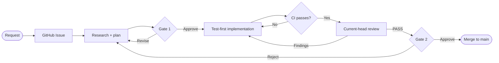

# Auto — Multi-Agent Software Development Framework

> **[→ Start here: Use the template](https://github.com/Mpfk/auto-template)** — click **"Use this template"** to create a repository with Auto pre-configured. *This repository is the framework source; consumers should use the template.*

Auto turns a request into a merged, tested, documented change. It files a
GitHub Issue, researches the problem, writes a plan, implements it test-first,
reviews it, and merges it—pausing only at the gates you choose to control.

It runs natively in **OpenAI Codex** (repository skills), **Claude Code** (slash
commands), and **GitHub Copilot** (chat agents). Every step is tracked in GitHub.

## Quick start

1. **[Use the template](https://github.com/Mpfk/auto-template)** and create a repository.
2. Set `TEST_CMD` in **`workflow.conf`** for your project.
3. Run **`bin/setup-hooks`** once per clone and worktree.
4. Connect GitHub through authenticated `gh` or the GitHub tools provided by your agent host.
5. For Copilot cloud, grant MCP write access using [`docs/auto/copilot-cloud-setup.md`](docs/auto/copilot-cloud-setup.md).

Then run `$auto` in Codex, `/auto` in Claude Code, or use the interactive
issue/merge interface for your provider.

## How it works


```mermaid
flowchart LR
    A([Request]) --> B[GitHub Issue]
    B --> C[Research + plan]
    C --> G1{Gate 1}
    G1 -- Approve --> D[Test-first implementation]
    G1 -- Revise --> C
    D --> CI{CI passes?}
    CI -- No --> D
    CI -- Yes --> R[Current-head review]
    R -- Findings --> D
    R -- PASS --> G2{Gate 2}
    G2 -- Approve --> M([Merge to main])
    G2 -- Reject --> C
```

`draft → researching → planning → [Gate 1] → ready → in-progress → [CI] → review → [Gate 2] → done`

The gates remain real in every mode. An explicit `$auto` or `/auto` invocation
self-approves them only after their prerequisites hold. An ordinary
implementation request uses interactive Gate 1 and Gate 2 behavior.

| You want | Codex | Claude Code | Behavior |
|---|---|---|---|
| Hands-off delivery | `$auto` | `/auto` | Drives through both gates after verification |
| Control at each gate | `$issue`, then `$merge` | `/issue`, then `/merge` | Stops for approval |

## Interfaces

### OpenAI Codex — repository skills

| Skill | Purpose |
|---|---|
| `$auto` | Drive the complete workflow to a verified merge |
| `$issue` | Create/research an issue, plan, and present Gate 1 |
| `$merge` | Validate current-head Gate 2 evidence, merge, and verify |
| `$develop` | Implement one Red-Green-Refactor cycle |
| `$review` | Run deterministic preflight and native-or-local review |
| `$document` | Update documentation for completed work |
| `$research` | Investigate one evidence-gathering strategy |

Codex loads root `AGENTS.md` and discovers these workflows under
`.agents/skills/`. No `.codex/config.toml`, plugin package, Action, or OpenAI
secret is required. See [`docs/auto/codex-setup.md`](docs/auto/codex-setup.md).

### Claude Code — slash commands

| Command | Purpose |
|---|---|
| `/auto` | Drive the full workflow to verified merge |
| `/issue` | Create/research an issue, plan, and present Gate 1 |
| `/merge` | Validate Gate 2, merge, and verify |
| `/develop` | Implement one Red-Green-Refactor cycle |
| `/review` | Validate tests, quality, documentation, and review evidence |
| `/document` | Maintain project documentation |
| `/research` | Investigate one research strategy |

### GitHub Copilot — chat agents

| Agent | Purpose |
|---|---|
| `@issue` | GitHub-native intake, research, planning, and Gate 1 |
| `@orchestrate` | VS Code entry point for issue, research, and planning |
| `@develop` | Implement one component via TDD |
| `@review` | Run pre-merge validation |
| `@documentation` | Maintain documentation |
| `@merge` | Validate Gate 2, merge, and verify |

## Core principles

- **Issue-first.** Every change is tied to a GitHub Issue.
- **Branch per issue.** Work happens on `issue/{number}`, never directly on `main`.
- **Test-first.** Red → Green → Refactor.
- **Conventional Commits.** Use `type(scope): description`.
- **Provider-neutral contracts.** All three interfaces load `docs/auto/playbooks/`.
- **Current-head evidence.** Gate 2 rejects stale review results.
- **Verified merges.** Auto confirms the PR, issue, and `main` state after merging.

## Configuration

`workflow.conf` is the only project-specific file you must edit. Set `TEST_CMD`;
source and test directories can be configured or auto-detected from common
project manifests.

## Distribution and updates

| Repository | Role |
|---|---|
| [Mpfk/auto](https://github.com/Mpfk/auto) | Framework source and versioned reusable CI |
| [Mpfk/auto-template](https://github.com/Mpfk/auto-template) | Consumer-ready snapshot used by “Use this template” |

- **CI logic updates automatically.** The template calls the reusable workflow
  at `@v1`, which moves with compatible releases.
- **Instruction files are a snapshot.** Shared playbooks, `AGENTS.md`, Codex
  skills/assets, Claude commands, Copilot agents, hooks, and docs are copied
  once and remain owned by the consumer repository. See
  [`docs/auto/UPGRADING.md`](docs/auto/UPGRADING.md).

## Developing the framework

1. Clone this repository.
2. Run `bin/setup-hooks`.
3. Configure GitHub access for your provider.
4. Use `$auto`/`/auto`, or the interactive `$issue`/`$merge` or `/issue`/`/merge` pair.

Releases are signed SemVer tags. Moving `v1` to a compatible release rolls CI
updates to consumers. See [`docs/auto/release-process.md`](docs/auto/release-process.md).

## Project structure

```text
├── AGENTS.md                   # Codex repository guidance
├── .agents/skills/             # Codex workflows
├── CLAUDE.md                   # Claude Code adapter
├── .claude/commands/           # Claude slash-command adapters
├── .github/agents/             # Copilot agent adapters
├── .github/codex/              # Optional Codex Action prompt/schema assets
├── .github/workflows/          # Automation and reusable CI
├── .githooks/                  # Local enforcement
├── bin/auto-review-preflight   # Deterministic Gate 2 checks
├── docs/auto/playbooks/        # Provider-neutral workflow contracts
├── tests/                      # Framework tests
└── workflow.conf               # Project-specific workflow configuration
```

## Documentation

- [`docs/auto/agent-flow.md`](docs/auto/agent-flow.md) — state machine and gates
- [`docs/auto/github-access.md`](docs/auto/github-access.md) — capability-based GitHub access
- [`docs/auto/codex-setup.md`](docs/auto/codex-setup.md) — native Codex setup and review behavior
- [`docs/auto/codex-github-action.md`](docs/auto/codex-github-action.md) — optional secure Codex Action recipe
- [`docs/auto/auto-template-repo.md`](docs/auto/auto-template-repo.md) — distribution model
- [`docs/auto/file-buckets.md`](docs/auto/file-buckets.md) — snapshot, reusable, and config files
- [`docs/auto/copilot-cloud-setup.md`](docs/auto/copilot-cloud-setup.md) — Copilot MCP write access
- [`docs/auto/release-process.md`](docs/auto/release-process.md) — signed release process
