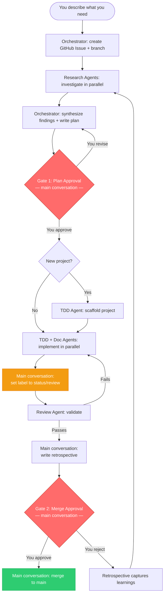
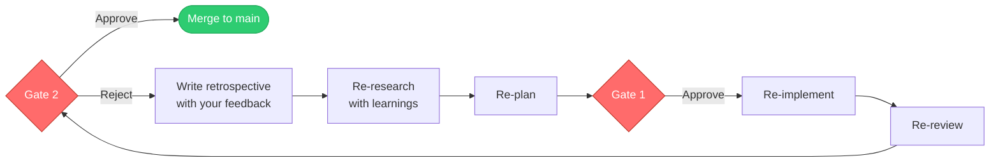
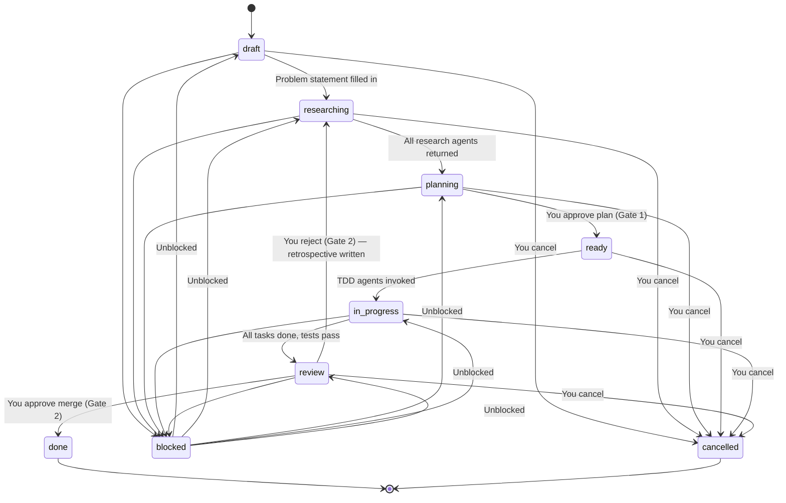
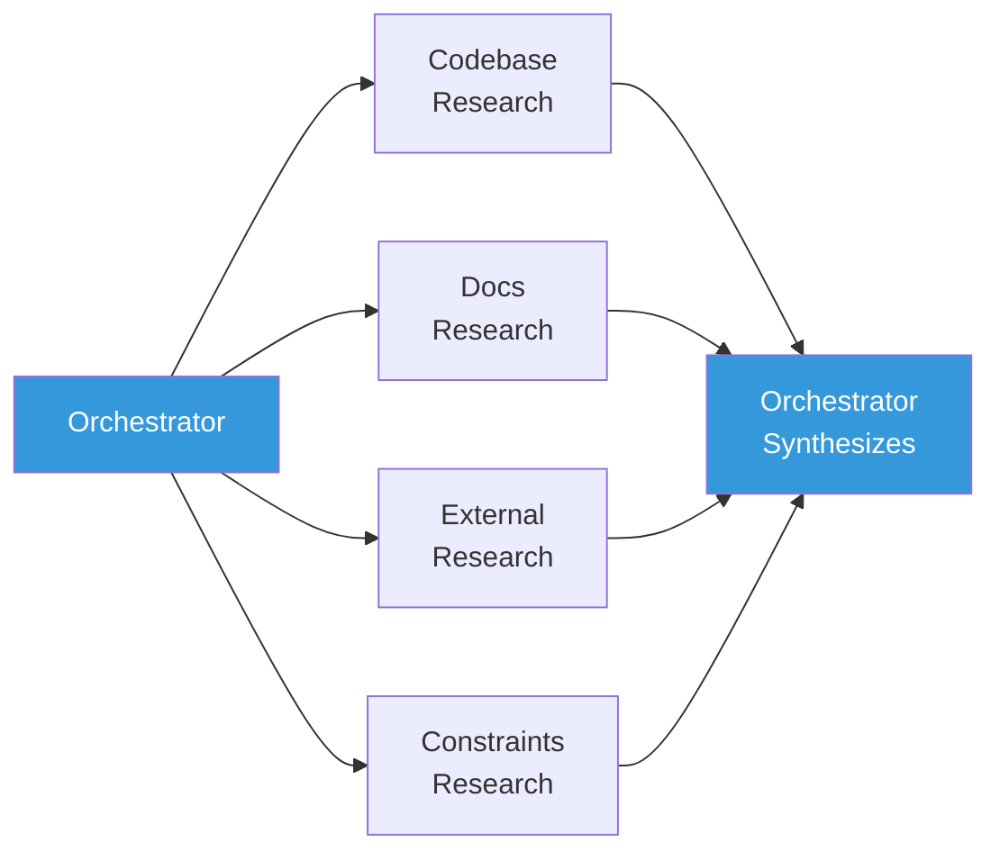
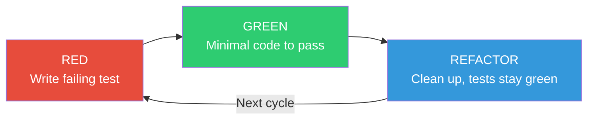

# Agent Flow: Multi-Agent Software Development Workflow

## What This Is

Auto is a structured software development workflow powered by five specialized GitHub Copilot agents. You describe what you need — a feature, a bug fix, a refactor — and the agents handle the work: researching the problem, planning the approach, implementing with test-driven development, reviewing the result, and merging to `main`.

The **main conversation** (you + Copilot) coordinates the workflow. Agents are short-lived workers for specific phases — no single agent runs the entire lifecycle. You stay in control at two key decision points and drive the state machine between them.

## How It Works

The workflow follows a phase-based pipeline coordinated by the main conversation. Agents are invoked as workers for specific phases and return when done. Two approval gates require your explicit sign-off.



Every piece of work is tracked as a GitHub Issue, developed on its own branch, implemented test-first, and documented before it reaches `main`.

## Phase Coordination

The main conversation drives the state machine. Agents are workers, not managers.

| Phase | Who runs it | What happens |
|-------|------------|--------------|
| 1. Init | Orchestrator agent | Creates GitHub Issue + branch, checks for duplicates |
| 2. Research | Research agents (parallel) | Investigate codebase, docs, external, constraints |
| 3. Synthesize + Plan | Orchestrator agent | Merges research, writes plan, presents Gate 1 |
| 4. Gate 1 | Main conversation | User approves or revises the plan |
| 5. Implement | TDD + Documentation agents (parallel) | Code via Red-Green-Refactor, update docs |
| 6. Review | Review agent | Validates TDD compliance, quality, tests |
| 7. Gate 2 | Main conversation | User approves merge or rejects with feedback |
| 8. Merge | Main conversation | Merges branch, closes issue |

### Parallel Execution Rules

When invoking multiple agents for a phase:
- Launch concurrent agents when tasks are independent.
- **Never** invoke an agent and then duplicate its work in the main conversation.

Parallelizable combinations:
- **Research:** All research angles (codebase, docs, external, constraints) in parallel.
- **Implementation:** TDD agent(s) + Documentation agent in parallel.
- **Review:** Always sequential (needs implementation complete).

### Agent Scope Budgets

Each agent invocation should complete in one shot:

| Agent | Target tool calls | Scope per invocation |
|-------|------------------|---------------------|
| Research (per angle) | ~10 | One research strategy |
| TDD (per component) | ~15-20 | One RED-GREEN-REFACTOR cycle |
| Documentation | ~10-15 | Update docs for one feature |
| Review | ~15-20 | Validate one branch |

If a TDD task requires multiple components, invoke **multiple TDD agents** (one per component) rather than asking one agent to do everything.

### Scaffold Phase (New Projects)

If this is the first implementation on the project (no `package.json` or build tool):
1. Include scaffold instructions in the TDD agent prompt.
2. The TDD agent sets up the project skeleton and commits as `chore(scaffold): ...`
3. TDD cycle (RED-GREEN-REFACTOR) begins AFTER the scaffold commit.

This prevents conflating infrastructure setup with feature implementation.

## Your Role: Two Approval Gates

You interact with the workflow at two gates. Agents cannot proceed past either one without your explicit approval.

### Gate 1 — Plan Approval

**When:** After research is complete and a plan has been drafted.

**You see:**
- Synthesized research findings (what the agents learned)
- Open questions that need your input
- The proposed plan with task breakdown
- Acceptance criteria

**Your options:**
- **Approve** — agents begin implementation
- **Revise** — request changes to the plan, answer open questions, adjust scope

**Why this matters:** The plan determines what gets built. Catching a bad plan here saves the entire implementation cycle.

### Gate 2 — Merge Approval

**When:** After implementation is complete, tests pass, and the Review Agent has signed off.

**Prerequisite:** The issue **MUST have the `status/review` label** before Gate 2 is presented. This transition happens when all TDD agents have completed, all tests pass, and the Review Agent has been invoked. The main conversation updates the issue label to `status/review` before presenting this gate — this is a hard rule, not optional.

**You see:**
- Review Agent summary (what passed, any concerns)
- Retrospective (what was attempted and how it went)
- Diff summary of all changes
- Proposed merge commit message

**Your options:**
- **Approve** — the branch merges to `main`, the issue is closed with `status/done`
- **Reject** — the workflow captures your feedback, writes a retrospective as an issue comment, and loops back to the Research phase to self-correct. Your feedback becomes input for the next iteration, and Gate 1 re-applies before any new implementation begins



### Cancellation

You can cancel any issue at any time. The main conversation will confirm, update the issue labels, and optionally clean up the branch.

## Issue Lifecycle

Every piece of work is tracked as a GitHub Issue with status labels. Each issue progresses through a strict state machine.

### Status Labels

| Label | What's happening | Who's working |
|-------|-----------------|---------------|
| `status/draft` | Issue created. Problem described. | Orchestrator |
| `status/researching` | Research Agents are investigating the problem. | Research Agents |
| `status/planning` | Research is done. A plan is being written. | Orchestrator |
| `status/ready` | Plan approved by you. Ready for implementation. | Orchestrator |
| `status/in-progress` | Code is being written following TDD. | TDD + Doc Agents |
| `status/review` | Implementation done. Being validated. | Review Agent |
| `status/done` | Merged to `main`. Issue closed. | - |
| `status/blocked` | Waiting on something external or your input. | Any agent |
| `status/cancelled` | Abandoned by your decision. Issue closed. | - |

### Type Labels

Issues also carry a type label: `bug`, `feature`, `refactor`, `docs`, `test`, `chore`.

### State Machine



### Transition Rules

| From | To | What must be true | Requires your approval? |
|------|----|-------------------|------------------------|
| `draft` | `researching` | Problem statement and description filled in | No |
| `researching` | `planning` | All Research Agents returned findings | No |
| `planning` | `ready` | Plan and acceptance criteria written | **Yes (Gate 1)** |
| `ready` | `in-progress` | At least one TDD Agent invoked | No |
| `in-progress` | `review` | All tasks done, all tests pass, docs updated | No |
| `review` | `done` | Review passes, retrospective written, **label is `status/review`** | **Yes (Gate 2)** |
| `review` | `researching` | You reject at Gate 2, retrospective captures learnings | **Yes (rejection)** |
| Any active | `blocked` | Agent cannot proceed, reason logged | No |
| `blocked` | Previous state | Blocking condition resolved | No |
| Any active | `cancelled` | You decide to stop | **Yes** |

**Critical rule:** The issue label MUST be updated to `status/review` BEFORE presenting Gate 2 to the user. This transition is performed by the main conversation when all TDD agents have completed and tests pass. The label `status/review` signals "awaiting human review." Skipping this transition is a workflow violation.

### Blocked Issues

Any agent can mark an issue as blocked. When this happens:
- A comment is added to the GitHub Issue (reason, what's blocking it, timestamp)
- The label `status/blocked` replaces the current status label
- The Orchestrator surfaces the block to you immediately
- When resolved, the issue returns to its previous status label and work continues

### Issue Structure

GitHub Issues use a structured body template (enforced via `.github/ISSUE_TEMPLATE/workflow-issue.yml`):

```markdown
## Problem Statement
## Description
## Research
### Key Findings
### Constraints
### Open Questions
## Plan
## Acceptance Criteria
## Retrospective
### Iteration 1
```

Branches follow the naming convention `issue/{issue-number}` (e.g., `issue/42`).

## Agents

Five specialist agents handle different parts of the workflow. Their definitions live in `.github/agents/`. The **main conversation** coordinates the workflow and invokes agents as workers for specific phases. No single agent runs the entire lifecycle.

All agent prompts must be **fully self-contained** — the invoker provides exact issue numbers, branch names, acceptance criteria (verbatim), and file paths. Agents do not discover context from file references or placeholders. Each agent has a guard clause: if required context is missing, it stops and reports what's needed.

### Orchestrator

Handles issue creation, research, and planning — Phases 1-3 of the workflow.

**What it does:**
- Checks for existing/overlapping GitHub Issues before creating new ones
- Creates the GitHub Issue (with `status/draft` label) and feature branch
- Selects and invokes the right Research Agents for the problem
- Synthesizes research findings (resolving conflicts using project conventions > documented decisions > external best practices)
- Writes the plan and presents it to you at Gate 1

**What it does NOT do:** Implementation, review, Gate 2, or merge — the main conversation handles those phases directly.

**Config:** `.github/agents/orchestrator.agent.md` | Model: Claude Opus 4 | Tools: read, edit, search, execute, agent, web

### Research Agent

Investigates one specific angle of a problem. The Orchestrator (or main conversation) invokes 2-4 of these in parallel, each assigned a different strategy.



| Strategy | What it investigates | Sources |
|----------|---------------------|---------|
| **Codebase** | Existing code patterns, data flows, test coverage gaps | Source files, tests, dependency graph |
| **Docs** | Documented decisions, past issues, constraints | `docs/`, ADRs, GitHub Issues, inline comments |
| **External** | Industry patterns, candidate libraries, known pitfalls | Web search, library docs, RFCs |
| **Constraints** | Security, performance, compatibility, platform limits | OWASP, API contracts, runtime requirements |

Each agent returns a structured report with key findings (cited with evidence), recommendations, open questions, and a confidence level. On re-research after a Gate 2 rejection, agents receive the retrospective and your feedback so they avoid repeating failed approaches. Target: ~10 tool calls per invocation.

**Config:** `.github/agents/research.agent.md` | Model: Claude Sonnet 4 | Tools: read, search, web (read-only — cannot modify files)

### TDD Agent

Implements one component using strict Test-Driven Development. Each invocation targets one RED-GREEN-REFACTOR cycle (~15-20 tool calls). If a task requires multiple components, invoke multiple TDD agents.



**The cycle:**
1. **RED** — Write a failing test that captures the desired behavior. Confirm it fails. Commit: `test: ... [RED]`
2. **GREEN** — Write the minimum code to make the test pass. No more. Commit: `feat: ... [GREEN]`
3. **REFACTOR** — Clean up duplication, improve clarity. Tests must stay green after every change. Commit: `refactor: ... [REFACTOR]`

**Scaffold handling:** For new projects (no `package.json` or build tool), the TDD agent sets up the project skeleton first and commits as `chore(scaffold): ...` before beginning the RED-GREEN-REFACTOR cycle.

If the agent discovers missing requirements, it logs a new GitHub Issue rather than scope-creeping.

**Config:** `.github/agents/tdd.agent.md` | Model: Claude Sonnet 4 | Tools: read, edit, search, execute

### Documentation Agent

Maintains all project documentation in `docs/`. Invoked by the main conversation after implementation tasks complete or when design decisions are made.

**What it does:**
- Updates `docs/api/` for API changes
- Updates `docs/architecture.md` for structural changes
- Creates Architecture Decision Records in `docs/decisions/` for significant choices
- Updates `README.md` for new setup steps
- Verifies no documentation exists outside `docs/` (except root `README.md`)

**Config:** `.github/agents/documentation.agent.md` | Model: Claude Sonnet 4 | Tools: read, edit, search, execute

### Review Agent

Pre-merge quality gate. Invoked by the main conversation after implementation is complete. Validates the entire branch before you see it at Gate 2.

**What it checks:**
- Commits follow Conventional Commits format
- TDD cycle: RED commits (test) appear before GREEN commits (implementation) in the git log
- Code quality: no dead code, no security vulnerabilities, clean abstractions
- Test quality: meaningful assertions, edge case coverage
- Documentation: `docs/` updated for user-facing or architectural changes
- Full test suite passes

**Output:** PASS (ready to merge) or FAIL (specific issues listed). On failure, the main conversation fixes the issues and re-runs review.

**Config:** `.github/agents/review.agent.md` | Model: Claude Opus 4 | Tools: read, search, execute (read-only — cannot modify files)

## Project Structure

```
project-root/
├── README.md                       # Project overview + setup steps
├── workflow.conf                   # Language-agnostic hook configuration
│
├── .github/
│   ├── copilot-instructions.md     # Copilot workspace instructions (auto-loaded)
│   ├── agents/                     # Agent definitions
│   │   ├── orchestrator.agent.md
│   │   ├── research.agent.md
│   │   ├── tdd.agent.md
│   │   ├── documentation.agent.md
│   │   └── review.agent.md
│   ├── hooks/                      # Copilot lifecycle hooks
│   │   ├── doc-freshness.json
│   │   └── scripts/
│   │       └── doc-freshness.sh
│   ├── workflows/                  # GitHub Actions CI
│   │   ├── conventional-commits.yml
│   │   └── test-suite.yml
│   └── ISSUE_TEMPLATE/
│       └── workflow-issue.yml      # Structured issue template
│
├── .githooks/                      # Git hook enforcement (dispatcher pattern)
│   ├── pre-commit                  # Dispatcher → pre-commit.d/
│   ├── pre-commit.d/
│   │   ├── 010-branch-guard.sh
│   │   ├── 020-doc-placement-guard.sh
│   │   └── 030-tdd-cycle-guard.sh
│   ├── commit-msg                  # Dispatcher → commit-msg.d/
│   ├── commit-msg.d/
│   │   ├── 010-conventional-commits.sh
│   │   └── 020-issue-linkage.sh
│   ├── pre-push                    # Dispatcher → pre-push.d/
│   ├── pre-push.d/
│   │   ├── 010-issue-status-consistency.sh
│   │   └── 020-test-suite-gate.sh
│   └── post-commit                 # Doc freshness reminder
│
├── docs/                           # All project documentation
│   ├── auto/                       # Workflow docs
│   │   └── agent-flow.md           # This file
│   ├── decisions/                  # Architecture Decision Records
│   └── api/                        # API specifications
│
├── src/                            # Source code
└── tests/                          # Test files
```

## Configuration

### `workflow.conf`

All git hooks source this file for project-specific settings. Edit it once when you adopt this template for a new project.

```bash
# Test command — how to run your test suite
TEST_CMD="npm test"        # pytest, go test ./..., cargo test, etc.

# Source directories — where implementation code lives
SRC_DIRS="src/ lib/"

# Test directories — where test files live
TEST_DIRS="tests/ test/"

# Protected branch name
MAIN_BRANCH="main"
```

### `.github/hooks/doc-freshness.json`

A Copilot PostToolUse hook that triggers after file edit operations, reminding the agent to check whether docs need updating when source files change. Runs `.github/hooks/scripts/doc-freshness.sh`.

### `.github/workflows/`

GitHub Actions that enforce workflow rules in CI:
- **conventional-commits.yml** — Validates all PR commit messages follow Conventional Commits format.
- **test-suite.yml** — Runs the full test suite (from `workflow.conf`) on every PR.

## Git Hooks

Eight hooks enforce workflow rules locally. They use a **dispatcher pattern** — each git hook type (pre-commit, commit-msg, pre-push) runs all scripts in its `.d/` subdirectory, so individual rules stay modular and can be enabled/disabled independently.

Activated by: `git config core.hooksPath .githooks`

### Pre-Commit Hooks

| Hook | What it enforces |
|------|-----------------|
| **Branch Guard** | Blocks direct commits to `main`. All work must happen on `issue/{number}` branches. |
| **Doc Placement Guard** | Blocks new `.md` files outside `docs/` (with exceptions for `README.md` and `.github/`). |
| **TDD Cycle Guard** | On issue branches, blocks source-only commits if no test commits exist on the branch yet. Allows source+tests together (GREEN phase) and source-only after tests exist (REFACTOR phase). |

### Commit-Msg Hooks

| Hook | What it enforces |
|------|-----------------|
| **Conventional Commits** | Rejects messages that don't match `type(scope): description`. Valid types: feat, fix, test, refactor, docs, chore. |
| **Issue Linkage** | Auto-appends `Closes #{number}` to commits on `issue/*` branches if not already present. |

### Pre-Push Hooks

| Hook | What it enforces |
|------|-----------------|
| **Issue Status Consistency** | Verifies the GitHub Issue exists and has at least `status/in-progress` label (via `gh` CLI). Prevents pushing work that hasn't been through research and planning. |
| **Test Suite Gate** | Runs the full test suite (via `$TEST_CMD` from `workflow.conf`). Broken code never leaves the local branch. |

### Post-Commit Hook

| Hook | What it does |
|------|-------------|
| **Doc Freshness Check** | After source files change, prints a reminder to verify `docs/` is up to date. Advisory only — does not block. |

## Conventional Commits

All commits follow this format:

```
type(scope): description

[optional body]

Closes #42
```

| Type | When to use | TDD Phase |
|------|-------------|-----------|
| `test` | Adding or updating tests | RED |
| `feat` | New feature implementation | GREEN |
| `fix` | Bug fix | GREEN |
| `refactor` | Code restructuring, no behavior change | REFACTOR |
| `docs` | Documentation changes | - |
| `chore` | Build, CI, tooling changes | - |

## Getting Started

1. **Start working:** Describe what you need. The Orchestrator agent creates a GitHub Issue, runs research, and writes a plan.
   ```
   @orchestrator Add user authentication with JWT tokens
   ```
   The Orchestrator handles init, research, and planning. The main conversation coordinates everything after Gate 1.

2. **Check progress:** View GitHub Issues for the status of all work (filter by `status/*` labels).

3. **Approve or reject:** You'll be prompted at Gate 1 (plan) and Gate 2 (merge). Read the summaries and decide.

4. **Cancel if needed:** Tell the main conversation to cancel an issue at any time.

## Future Iterations

- [x] CI/CD integration — GitHub Actions enforce rules in CI
- [ ] Issue dependency graph — visualize parent/child/parallel issue relationships
- [ ] Agent performance metrics — track cycle times and test coverage trends
- [ ] Automated issue triage — classify and prioritize by codebase impact
- [ ] Cross-repo support — coordinate issues across multiple repositories
