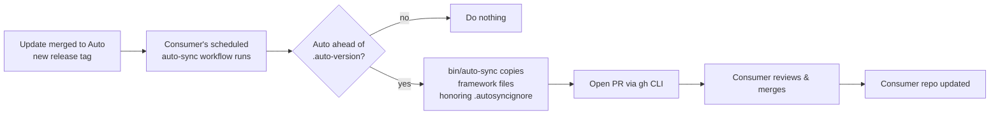

# Template Propagation — Architecture & Distribution Model

> **Status:** Accepted (2026-06-13). Architecture decided; implementation pending.
> The build flows through the normal Auto workflow (issue → plan → Gate 1 →
> develop → review → Gate 2). See the Implementation plan at the end.

## Decision summary

- **Distribution:** **vendored sync** (not a subscribable package). Files are
  copied into consumer repos; updates arrive as reviewed PRs.
- **Mechanism:** first-party only — a vendored `bin/auto-sync` script + a scheduled
  `auto-sync.yml` workflow that opens a PR via the `gh` CLI. No third-party
  marketplace Actions (GitHub-official `actions/*` permitted).
- **Repository topology:** **two repos** — `auto` (framework source of truth + dev
  home, not a template) and `auto-template` (the clean, instantiable GitHub
  template). Consumers are born from `auto-template` and sync updates from `auto`'s
  signed release tags.
- **Customization model:** *extend, don't edit* — Auto owns files, consumers add
  files in reserved namespaces (`100+` hook scripts, new commands), enforced by
  `.autosyncignore`.

## Problem

Auto is a GitHub **template repository**. GitHub's template feature copies all
files into a new repo **once, at creation time, then severs the link**. There is
no live connection back to the template.

Consequence: when we fix a bug or add a feature to Auto's framework files (a git
hook, a slash command, an agent definition, a CI workflow), every downstream repo
generated from the template keeps its **frozen fork** of that file and never
receives the update.

**Goal:** a mechanism to propagate Auto framework updates to consumer repos that is
safe (never clobbers a consumer's own work), reviewable, and — ideally — rides
Auto's own issue→PR→gate workflow.

## Repository topology

Auto is split into **two repositories**, separating "where the framework is
developed" from "what a new project starts as."

| Repo | Role | GitHub "template"? | Contains |
|------|------|--------------------|----------|
| **`auto`** | Source of truth + dev home. Tags **signed releases**. | No | Framework files, release tooling, RFC/design docs, framework's own CI + tests, contribution docs |
| **`auto-template`** | Clean, minimal starter that consumers instantiate. | **Yes** | Framework files (mirrored from `auto` on release), `auto-sync.yml`, starter `README`, placeholder `src/`/`tests/`, seed `workflow.conf` |

**Why split:** GitHub's "New from template" copies the *entire default branch* into
the new repo. A repo cannot cleanly be both a development home (dev tooling, design
docs, release automation, issue history) and a pristine starter — that content would
leak into every consumer and its dev workflows would run inappropriately in consumer
CI. Best practice: a template repo contains *exactly* the starter state, nothing
more. Two concerns → two repos.

**Lineage & sync source:**

- Consumers click **"New from template"** on **`auto-template`** (unchanged UX).
- A consumer's `auto-sync.yml` pulls framework updates from **`auto`'s signed
  release tags** — the singular source of truth, preserving the signed-tag security
  model (see Security considerations).
- On each `auto` release, `auto-template`'s own scheduled `auto-sync.yml` workflow
  refreshes the template so freshly-created repos don't start far behind (avoids an
  immediate large catch-up sync PR). No secrets required — the workflow uses only
  `GITHUB_TOKEN` to pull from the public `Mpfk/auto` repo.

```
        develop + sign release tags
                  │
                  ▼
            ┌───────────┐   auto-template's       ┌───────────────┐
            │   auto    │   auto-sync.yml pulls ▶ │ auto-template │
            │ (source)  │   (GITHUB_TOKEN only)    │  (template)   │
            └─────┬─────┘                         └───────┬───────┘
                  │                                       │ New from template
   auto-sync pulls│ signed release tags                   ▼
   framework files│                              ┌───────────────────┐
                  └─────────────────────────────▶│  consumer repo(s) │
                                                  └───────────────────┘
```

## Core principle

> **Every file is owned by exactly one party: Auto *or* the consumer. No file is
> owned by both.** Customization happens by *adding* files in reserved
> namespaces, never by *editing* shared ones.

This turns "update" from a 3-way merge negotiation into a safe overwrite, which is
what makes the whole propagation story viable.

## File ownership model

Every path in a consumer repo falls into one of three buckets:

| Bucket | Paths | Update behavior |
|--------|-------|-----------------|
| **Framework** (Auto owns) | `.claude/commands/`, `.githooks/` (Auto-numbered scripts + `lib/` + dispatchers), `docs/auto/`, `.github/agents/`, `.github/workflows/`, `.github/hooks/`, `.github/ISSUE_TEMPLATE/`, `.github/labels.yml`, `.github/copilot-instructions.md`, `.github/pull_request_template.md` | **Overwrite** on update |
| **Config** (consumer owns, Auto seeds once) | `workflow.conf`, `.claude/settings.json` | **Write if missing; never overwrite** |
| **Consumer's own** | `src/`, `tests/`, their `README.md`, their project-specific `CLAUDE.md` content | Auto never touches |

## How consumers customize — *extend, don't edit*

Framework files are effectively read-only to consumers. The updater overwrites
them. Consumers customize by adding files in reserved namespaces:

### Hooks — number-range convention (already supported by the dispatcher)

The hook dispatchers already run **every** `*.sh` in their `.d/` directory in
lexical order:

```bash
# .githooks/pre-commit
for hook in "$HOOK_DIR"/*.sh; do ... done
```

So we reserve ranges:

- **`000`–`099` = Auto-owned.** The updater overwrites exactly these.
- **`100`+ = consumer-owned.** The updater never touches them.

A consumer adds `pre-commit.d/100-my-lint.sh`; it runs after Auto's guards and
survives every update. Zero conflict, because the updater only writes files it
owns by name.

### Config values — `workflow.conf`

Behavioral knobs (test command, source/test dirs, main branch) are *data*, not
code. They live in `workflow.conf` (config bucket = never overwritten). If a
consumer wants to edit a framework script just to change a value, that's a signal
to promote the value into `workflow.conf`.

### Commands & agents — override-by-shadowing

`.claude/commands/` and `.github/agents/` have no `.d/` loader. Same spirit
applies: consumers add **new** files (`issue-mobile.md`) rather than editing
shipped ones (`issue.md`). (Open question: do we need a `*.local.md` shadow that
the updater skips? Start without it; add only if demand appears.)

## Propagation mechanism — GitHub-native (chosen direction)

**Scope: Auto is a _public_ template.** Propagation must therefore be
**consumer-initiated** — we have no access to push into consumers' repos. The
design uses GitHub platform features instead of a hand-rolled updater.

### Layer A — first-party sync (files: hooks, commands, agents, docs)

**No third-party marketplace Actions** (hard constraint). GitHub-*official*
`actions/*` (e.g. `actions/checkout`) are permitted; PRs are opened with the
pre-installed `gh` CLI (`gh pr create`), not a marketplace Action.

Two first-party pieces, both owned by us:

1. **`bin/auto-sync`** — a vendored shell script (shipped in the template, so
   every consumer has it). Holds all the logic: fetch Auto at the latest release
   tag, copy framework paths, honor the ignore list, skip config/consumer-owned
   paths, stamp `.auto-version`. Runnable by hand anytime.
2. **`.github/workflows/auto-sync.yml`** — a thin scheduled workflow (cron +
   manual dispatch) that runs **in the consumer's repo**, calls `bin/auto-sync`,
   and opens a PR with the diff via `gh`. The scheduler gives automatic
   propagation discovery; the script keeps the logic in one place.

The ownership model is enforced by our own **`.autosyncignore`** (gitignore
syntax) — this *is* the contract, no separate manifest/checksum code:

```
# .autosyncignore — paths Auto sync must NEVER overwrite
workflow.conf
.claude/settings.json
src/
tests/
.githooks/**/1[0-9][0-9]-*.sh   # consumer-owned 100+ hook scripts
```

Framework files sync; config, consumer code, and `1xx-` scripts are ignored.

### Layer B — Reusable workflows (CI)

The CI layer propagates *automatically* without file copying. A consumer's
workflow is a thin shim that calls Auto's reusable workflow by version:

```yaml
jobs:
  ci:
    uses: Mpfk/auto/.github/workflows/test-suite.yml@v1
```

Consumers floating `@v1` receive new CI logic on every minor/patch release with
no PR and no copied file. Only workflows support remote reference, so this layer
is workflow-only; everything else goes through Layer A.

### Retained / dropped

Retained: **semver git tags** on Auto, a **`CHANGELOG.md`**, the
**number-range convention** (enforced via `.autosyncignore`), and a
`.auto-version` stamp so the sync can detect "behind." No `auto-manifest.yml`
needed — the ignore file plus the script's path list cover it.

### Workflow-file propagation — the `AUTO_SYNC_TOKEN` opt-in

GitHub forbids the default `GITHUB_TOKEN` from creating or updating files under
`.github/workflows/**` (a hard platform rule — the push is rejected with
*"refusing to allow a GitHub App to create or update workflow … without
`workflows` permission"*). `auto-sync.yml` is itself a workflow file, so without
mitigation a sync that touched any workflow would fail the entire push.

The sync workflow handles this with a **hybrid opt-in**:

| Mode | Secret | Behavior |
|------|--------|----------|
| **Default** | none | Syncs everything **except** `.github/workflows/**` using `GITHUB_TOKEN`. Works out of the box, zero secrets. If the upstream sync would have changed any workflow files, those paths are **listed in the sync PR body** under *"⚠️ Workflow files changed upstream — apply manually"* so you can copy them by hand from `Mpfk/auto`. |
| **Opt-in** | `AUTO_SYNC_TOKEN` | The token is used for both checkout and push, so `.github/workflows/**` propagates automatically with the rest of the sync. No manual-apply note needed. |

**Configuring the opt-in (`AUTO_SYNC_TOKEN`):**

1. Create a **fine-grained personal access token** scoped to **only your own
   consumer repo** with these repository permissions:
   - **Contents:** Read and write
   - **Workflows:** Read and write
   - **Pull requests:** Read and write
2. Add it as a repository secret named `AUTO_SYNC_TOKEN`
   (Settings → Secrets and variables → Actions → New repository secret).

That's it — `auto-sync.yml` prefers `AUTO_SYNC_TOKEN` when present and silently
falls back to `GITHUB_TOKEN` when it is absent. The secret is **optional**;
leaving it unset just means workflow-file updates are surfaced for manual
application instead of being applied automatically.

> Scope the token to the single consumer repo. It is never sent upstream — it is
> only used by the consumer's own Actions run to push the sync branch.

### Known gotcha — GITHUB_TOKEN and CI on the sync PR

PRs opened by the default `GITHUB_TOKEN` do **not** trigger other workflows
(GitHub's recursion guard), so the consumer's CI may not run on the sync PR
automatically. Options: (a) accept it — the consumer's merge re-runs CI on
`main`; (b) document a PAT for consumers who want CI on the sync PR itself.
Lean (a) for simplicity. Tracked in open questions.

### Dogfooding note

The sync workflow opens a PR directly, overlapping Auto's issue→PR→gate flow.
Open question below: let the sync PR stand alone, or open an *issue* first so it
rides the full `/auto` pipeline?

## Consumer onboarding (creation flow)

Creating a consumer repo is **unchanged** — still GitHub's **"New from template"**
("Use this template"). The sync machinery ships inside the template, so a new repo
has `bin/auto-sync`, `.github/workflows/auto-sync.yml`, `.autosyncignore`, and the
`.auto-version` stamp from the moment it is created.

> Note: the sync does **not** depend on GitHub's template-link metadata — the
> upstream (`Mpfk/auto`) is configured in the script/workflow itself, so it also
> works for repos copied or forked some other way.

One-time setup after creation:

1. **New from template** (as today).
2. `git config core.hooksPath .githooks` — activate hooks (already required today;
   not new).
3. **Enable Actions to open PRs:** Settings → Actions → General → *"Allow GitHub
   Actions to create and approve pull requests"* (off by default on new repos —
   this is the only genuinely new step).
4. *(Optional)* Add an `AUTO_SYNC_TOKEN` secret if you want `.github/workflows/**`
   updates applied automatically (see *Workflow-file propagation* above). Without
   it, workflow-file changes are listed in the sync PR for manual apply.
5. *(Optional)* Run `auto-sync.yml` via **Run workflow** (manual dispatch) once to
   pull the latest immediately, instead of waiting for the first scheduled run.

Thereafter the scheduled workflow runs on its own and opens an update PR whenever
Auto is ahead of the consumer's `.auto-version`.

## Propagation flow (diagram)



## Tradeoffs accepted

- Consumers **cannot** alter the internals of core framework scripts — only add
  around them or toggle via config. This is intentional: the value of Auto is a
  *consistent* workflow across repos. Divergence in core behavior should be a
  signal to change *Auto*, not the consumer's copy.

## Security considerations

The sync propagates **executable content** — git hooks (run on every local commit)
and CI workflows (run with repo tokens). It is therefore a supply-chain channel and
must be treated like one.

| # | Risk | Severity | Mitigation |
|---|------|----------|------------|
| 1 | **Upstream compromise** of `Mpfk/auto` fans malicious code out to every consumer as a ready-to-merge PR (hooks + CI run it). | High | Branch protection + required review + **signed commits/tags** on Auto; sync only from **immutable, signed release tags** (never `main`/floating); 2FA + minimal maintainers. |
| 2 | **CI-skip gotcha** — `GITHUB_TOKEN` PRs don't trigger consumer CI, so a human diff review is the only gate. | High | Require CI on sync PRs (opt-in PAT) and/or `CODEOWNERS` on `.github/` + `.githooks/`. |
| 3 | **Self-modifying sync** — a sync PR can change `auto-sync.yml`'s own triggers/permissions. | Medium | Keep workflow `permissions:` minimal + explicit; highlight workflow-file changes in review. |
| 4 | **Write-scope** — a path bug or bad `.autosyncignore` could clobber config or touch secrets. | Medium | Script writes an explicit **allow-list** of framework paths (default: don't touch); never reads/echoes secrets. |
| 5 | **"Allow Actions to create PRs"** toggle expands the privilege surface. | Low | Scoped to consumer's own repo; document so consumers opt in knowingly. |
| 6 | **Patch-adoption gap** — a security fix won't reach a consumer who ignores the sync PR. | Inverse risk | Reusable workflows for the CI layer auto-propagate fixes (trades against risk #1's moving-ref trust). |

Net: security weight shifts onto **(a) protecting Auto as a now-critical upstream**
and **(b) ensuring the sync PR is genuinely validated, not rubber-stamped.**

## Prior art

This design is not novel — it applies recognized patterns:

- **Dependabot / Renovate** — scheduled job opens reviewed, CI-gated PRs proposing
  updates. The sync workflow is the same pattern for a vendored framework.
- **`copier` / `cruft`** (cookiecutter) — purpose-built tools for propagating
  template updates to repos generated from a template. This is that niche.
- Change flow (trunk dev → semver release → reviewed PR → CI gate → merge) is
  standard code-review + CI-gated delivery.

Known divergence from the ideal: **vendoring** (copying source into each repo) is
generally inferior to **true dependency referencing** (a versioned package). See
"Alternative considered" below — but a public template whose payload is git hooks,
slash commands, and agent markdown *cannot* be referenced remotely (only workflows
can), so vendoring + sync is correct **given the constraints**.

## Open questions (brainstorm backlog)

- [x] **Scope of consumer base:** _public template_ → consumer-initiated pull only.
- [x] **Distribution model:** _first-party only_ — vendored `bin/auto-sync` +
  scheduled `auto-sync.yml` (GitHub-official actions + `gh` CLI), reusable
  workflows for CI (deferred). No third-party marketplace Actions.
- [ ] **Sync-PR CI:** accept that `GITHUB_TOKEN` PRs skip CI (re-runs on merge),
  or document an opt-in PAT for consumers who want CI on the sync PR?
- [ ] **Sync PR vs issue:** let `actions-template-sync`'s PR stand alone, or have
  it open an *issue* first so the update rides the full `/auto` gate pipeline?
- [ ] **Reusable-workflow trust:** floating `@v1` means consumers run our
  centrally-hosted CI logic. Acceptable for a public template, or pin to a SHA and
  let template-sync bump it? (Security vs. auto-propagation tradeoff.)
- [ ] **Versioning:** semver + git tags + `CHANGELOG.md`. How do breaking
  framework changes (e.g. a hook contract change) get signaled — major bump +
  `UPGRADING.md`?
- [ ] **First-run / bootstrap:** does `git config core.hooksPath .githooks` and
  label sync still need a one-time setup step, or can `repo-setup.yml` handle it
  on template instantiation?
- [ ] **`.claude/settings.json`** — pure config, or does some of it need to track
  framework changes (e.g. new hook registrations)? May need splitting.
- [ ] **Override-by-shadow for commands/agents** — needed, or is add-new enough?
- [ ] **Partial updates / pinning** — can a consumer pin to an older Auto version
  or skip a release?
- [ ] **Migrations** — when a release needs more than file overwrite (e.g. rename
  a label, move a file), where do migration steps live?

## Alternative considered: package subscription

Instead of vendoring files and syncing them, publish Auto as a **versioned package**
(npm / GitHub Releases / container) that consumers **subscribe** to via a dependency
declaration. Logic lives in the package; the consumer repo holds only thin shims
(e.g. `.githooks/pre-commit` calls `auto-precommit` from the package) plus a pinned
version + lockfile. Updates arrive as Dependabot version-bump PRs.

The catch for Auto specifically: **slash commands and agent markdown must be real
files Claude reads** — they can't be shimmed, so even a package model has to
*materialize* those on install. And a package imposes an ecosystem (e.g. Node) on
consumers, whereas Auto targets any language.

### Vendored sync vs package subscription

| Dimension | Vendored sync (chosen) | Package subscription |
|-----------|------------------------|----------------------|
| **Distribution** | Git tags on Auto; files copied in | Registry (npm / GHCR / Releases) |
| **What's in consumer repo** | Full copies of all framework files | Thin shims + version pin + lockfile |
| **Logic update** | Every change re-copies files (churn) | Version bump; little/no file churn |
| **Versioning / pinning** | `.auto-version` stamp (home-grown) | First-class semver + lockfile |
| **Update propagation** | Scheduled workflow → PR | Dependabot → PR |
| **Rollback** | Revert the sync PR | Pin previous version |
| **Hooks** | ✅ copied | ✅ shim → package |
| **CI workflows** | ✅ copied (or reusable wf) | ✅ reusable wf / shim |
| **Slash commands / agents** | ✅ copied | ⚠️ must still be materialized |
| **Ecosystem requirement** | None (git + gh only) | Imposes Node/registry on consumers |
| **Infra you maintain** | Sync script + workflow | Publish pipeline + registry + CLI |
| **Supply-chain surface** | Git repo (tag signing) | Registry (package signing, deps) |
| **Offline / air-gapped** | Works (git clone) | Needs registry access |
| **Onboarding** | New-from-template + 1 toggle | New-from-template + install step |
| **"New from template" fit** | Native — files already present | Needs post-create install/bootstrap |
| **Patch adoption** | Manual (merge the PR) | Manual (merge the bump) — or float a range |
| **Maturity of pattern** | `copier`/`cruft` | npm/Dependabot (very mature) |

**Summary tradeoff:** the package model is the *cleaner dependency story* (real
semver, less file churn, mature tooling) **but** imposes an ecosystem, needs publish
infra, and *still* can't avoid materializing commands/agents — so it doesn't fully
escape vendoring for Auto's payload. The vendored sync is *lower-infra and
language-agnostic* but carries vendoring's drift and home-grown versioning. The
decision hinges on: **are consumers willing to take a Node (or similar) dependency,
and are you willing to run publish infra, in exchange for a cleaner version story?**

## Implementation plan

Sequenced by dependency. Each item is intended to become a GitHub Issue and run
through the standard Auto workflow (TDD where code is involved).

### Phase 0 — Foundations (in `auto`)
- **0.1 Versioning & releases.** Adopt semver git tags, add `CHANGELOG.md`, define
  the `.auto-version` stamp format. *(chore/docs)*
- **0.2 Upstream hardening.** Branch protection on `main`, required review, **signed
  commits + signed release tags**, minimal maintainers/2FA. Mitigates security #1.
  *(chore)*
- **0.3 Framework path allow-list.** A single canonical list of framework paths,
  consumed by *both* the sync script and the mirror job (one source of truth).
  *(feat/docs)*

### Phase 1 — Ownership & conventions
- **1.1 `.autosyncignore`.** Author the ignore file encoding config + consumer-owned
  paths + `1xx` hook range. *(feat)*
- **1.2 Hook number-range convention.** Document `000–099` = Auto, `100+` = consumer;
  add guard/notes in the dispatchers. *(docs/refactor)*
- **1.3 File-bucket audit.** Classify every current path; decide handling of the
  `src/`/`tests/` scaffolding. *(docs)*

### Phase 2 — Sync engine
- **2.1 `bin/auto-sync`.** Fetch a signed release tag, **verify signature**, copy
  allow-listed framework paths honoring `.autosyncignore`, stamp `.auto-version`,
  leave changes uncommitted. Strict TDD. *(feat)*
- **2.2 `auto-sync.yml`.** Scheduled + manual-dispatch workflow that runs the script
  and opens a PR via `gh`; minimal `permissions:`; only `actions/checkout`. *(feat)*
- **2.3 Sync-PR CI decision.** Accept `GITHUB_TOKEN` CI-skip (re-run on merge) or
  document opt-in PAT; add `CODEOWNERS` for `.github/` + `.githooks/`. *(feat/docs)*

### Phase 3 — Repository split
- **3.1 Create `auto-template`.** New repo, clean starter contents only; mark as a
  GitHub template repository. *(chore)*
- **3.2 Template sync via auto-sync.yml.** `auto-template` runs its own `auto-sync.yml`
  on a weekly schedule to pull framework updates from `Mpfk/auto` using `GITHUB_TOKEN` only.
  No cross-repo PAT required. *(feat — completed, see issue #119)*
- **3.3 De-template `auto`.** Remove the template flag from `auto`; strip
  consumer-only assumptions; keep dev tooling. *(chore)*

### Phase 4 — Onboarding & docs
- **4.1 README onboarding** (both repos): new-from-template → hooks path → enable
  "Allow Actions to create PRs" → optional manual sync. *(docs)*
- **4.2 `UPGRADING.md`** for breaking framework changes. *(docs)*

### Phase 5 — Validation & rollout
- **5.1 End-to-end pilot.** Instantiate a throwaway consumer from `auto-template`,
  run a full sync cycle, verify: PR opens, `workflow.conf` untouched, a `1xx-`
  hook survives, `.auto-version` advances. *(test)*
- **5.2 Friction pass.** File issues for any gaps found; iterate. *(chore)*

**Critical path:** 0.1 → 0.3 → 1.1 → 2.1 → 2.2 → 3.1 → 3.2 → 5.1. Phases 1.2/1.3,
0.2, and 4.x can run in parallel off the critical path.

## Decision log

- _2026-06-13_ — Chose **extend-don't-edit** over fork-and-merge. Rationale:
  conflict-free overwrites; the hook dispatcher already supports additive `.d/`
  extension. Number range `000–099` = Auto, `100+` = consumer.
- _2026-06-13_ — Scope = **public template**; propagation is **consumer-initiated**.
- _2026-06-13_ — **Third-party marketplace Actions ruled out** (non-starter).
  GitHub-official `actions/*` permitted.
- _2026-06-13_ — Chose **first-party sync**: vendored `bin/auto-sync` + scheduled
  `auto-sync.yml` (opens PR via `gh` CLI) for files; **reusable workflows** for CI
  (deferred). Dropped `auto-manifest.yml` and custom checksums; ownership enforced
  by `.autosyncignore`.
- _2026-06-13_ — **Confirmed vendored sync over package subscription.** Rationale:
  Auto is a public, language-agnostic template; the package model imposes an
  ecosystem (Node/registry) + publish infra and still must materialize
  commands/agents, so its main benefit is half-defeated for Auto's payload.
- _2026-06-13_ — **Two-repo topology:** `auto` (source/dev, not a template) +
  `auto-template` (clean GitHub template). Consumers instantiate `auto-template`
  and sync from `auto`'s signed release tags. Rationale: a template repo should
  contain exactly the starter state; dev tooling must not leak into consumers.
- _2026-06-13_ — Status moved to **Accepted**; implementation plan added.
